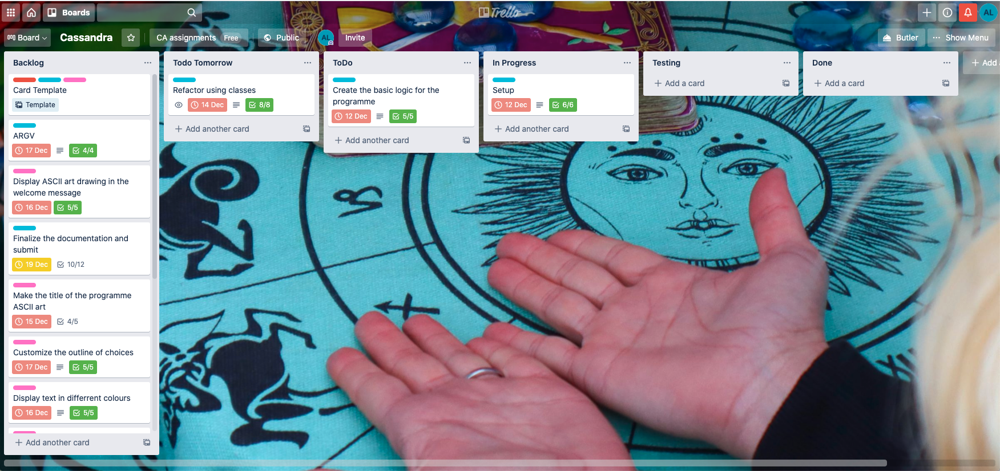
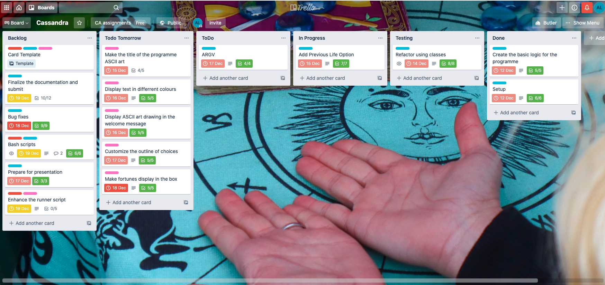
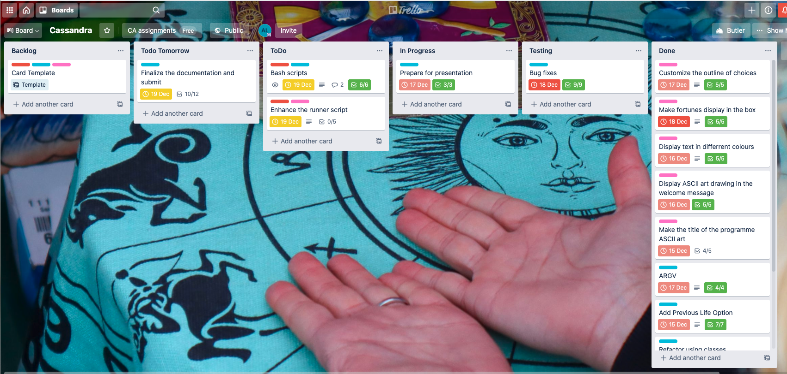
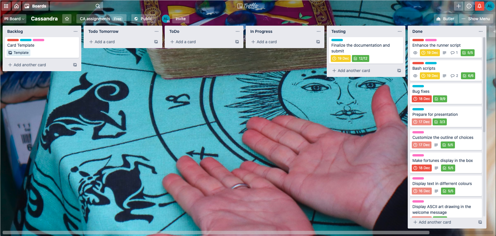

# Cassandra: your most truthful fortune teller app

Cassandra tells you your fortune or who you were in your past life. After you've heard enough, you can look back at all of your fortunes and save them in a file.

To have a better experience, make your terminal window at least **82 cols wide**. It's okay if you choose not to though, the programme is responsive to different window sizes.

Github repository: <https://github.com/chivoi/cassandra>

## System requirements

Cassandra uses Ruby version 2.7.1.
Bundler version 2.1.4 was used for gem dependencies management.
RSpec 3.10.0 was used for automated testing.
## Installation and Execution

To install everyhting needed to run Cassandra, run this script in your terminal:
```
$ ./install.sh
```
It will install homebrew, current Ruby version, clone this repository to your local machine, install bundler and all gem dependencies.

To run the programme in the default mode, run this command from the src folder:

```
$ ./run.sh
```

To run the programme with command line arguments:

```
ruby cassandra.rb -yourargument
```

## Command line arguments

Cassandra accepts following command line arguments: 

- `-h` for programme info
- `-v` for Cassandra and Ruby verison info
- `-p file/path` to pass in your previously saved fortunes
- `-n Your Name` to let Cassandra know your name
- `-f Name` if you want your fortuneteller to be called another name

## Gem dependencies

This app uses following gems:

Gem             | Version|
----------------|--------|
 httparty       | 0.18.1 |
 ruby-progressbar|  1.10 | 
 terminal-table |   2.0  |
 artii          |   2.1  |
 tty-markdown   |  0.7.0 |
 tty-prompt     | 0.23.0 |
 tty-box        |  0.6.0 |
 tty-screen     |  0.8.1 |
 rainbow        |   3.0  |

## API-s

- [Quotable](https://github.com/lukePeavey/quotable#get-random-quote)
- [Pipl](https://pipl.ir/)

## ASCII art

Ascii art  was sourced on: https://ascii.co.uk/art/fortune , the characters 'smd' were kept in is as a credit to the author.

## Purpose and scope - need to write more

When I was a kid back home in Russia, we used to play fortune-tellers with my cousin all the time. We would do card readings (the usual) or "book" readings: pick up a random book, the "client", would choose the page and the line, and the "fortune-teller" would go to that page and line and read out a quote, which was supposed to indicate what the client is to expect in the future or focus on in the present.

Cassandra is a fortune-teller app that was inspired by that game I played with my cousin. She can give user a prediction using famous quotes, tell the user who they were in past life, as well as create, read, delete and write into a fortunes log for their further reference.

This app in a way is a mental health aid for the people in need. Unlike the real life fortune-tellers, Cassandra's advices and predictions are mostly motivational. The app was created solely for intertainment, so it can help people be intertained whenever they feel like it. Or, if they are a believer in fortune-telling and predictions and feel a bit uncertain in life, Cassandra can help them receive some meaningful guidance. After all, one can argue that nothing that comes to our life is really random, including fortunes from a little terminal app.

The target audience for this app is people with some coding skills, that are confident with using the command line and can handle the installation process. They are also the people that like to be entertained. Whenever they are bored or procrastinating, or need to make a hard desicion in life, or feel like nothing makes sense, they can open their terminal, run Cassandra and receive some great fortunes to keep them going.

## Featuress

Cassandra has following features:

**"What my future holds"**

This is one of the main menu options, the user chooses it with an input. The menu is formatted with tty-prompt, so they select it with arrows on a keyboard and the "enter" key. Then, the programme displays a progress bar (made with ruby-progressbar gem), clears screen and displays a formatted string containing the fortune. The string is formatted with tty-box, as well as the rainbow gem. The strings are sourced from the Quotable API, they are random quotes from famous people, minus the name of the author. This is handled by the `FortuneTeller` class and a method `tell_fortune`. After the user gets their fortune, they can save it in their fortunes log, or get another one.

**"Who was I in previous life"**

This is another main menu option. It works similarly with telling fortunes, but gets data from differrent API - Pipl, a fake people generator. The response from the API comes in a form of a hash of hashes with all sorts of data, from first and last name to social security number, phone number, insurance etc. I have selected only some of the keys that can be valid for current app, like name, some physical data, birthplace, etc. I have changed some keys names to make more sence with the app. This feature is handled by it's own class `PreviousLife` and `FortuneTeller` class that uses a method from `PreviousLife`.

**Log file handling**

When the user have received their fortunes or previous life readings, they are prompted to save them in their fortunes log. If they don't have t yet, the programme detects it and creates one. The writing to the file happens after every fortune is displayed, when the user says that they want to save it. After outputting fortunes, the programme also adds them to current session's fortunes list. If the user wants to quit, they are asked if they want to keep or delete the log. If they choose to keep it, the programme shows the file path to it.

**Some other features include:**

- Menu displaying options
- Display user's fortunes just for the current session
- Display all fortunes from the log
- Display goodbye message
- Display greeting message
- Handles Standard error and Validation Error
- Handles fivr command line arguments
- With -f argument the fortuneteller can be renamed from Cassandra to anything you like
- With -h argument, parses the README file in customized colour scheme
- Responsive: changes the ascii header font and adds/removes ascii image depending on a width of a terminal screen, changes the size of the fortune box depending on the screen size.

## User Interaction experience

**How the user will find out how to interact with / use each feature***

There is a convenient `install.sh` bash script that will install everyhting necessary for the user to run the programme. There is also a runner script `run.sh` for the easier running of the app.
After the user runs the app, all user interaction are driven with prompts. Right away after starting the programme, the user sees menu options, which also has a prompt on how to use it (move cursor with up and down arrows and select with 'enter' key). Throughout the session, the prompts will appear after every option is executed.

**How the user will interact with / use each feature**

The user will have access to all features from the main menu. 

If they select _"What does my future hold"_, they will see their fortune output on the screen. Then, they can choose whether they want to save it in a Fortunes Book (log). After that, they are offered to get another prediction or move on.

When they select _"Who was I in past life"_, they will see a table with the data output to the screen. They can choose whether they want to save it or not.

When they select _"Display my fortunes"_, depending on whether they have a log file and whether they received any fortunes in the current session, they can choose to display the fortunes from the current session, or the entire contents of the log.

Finally, when they select _"Bye ..."_, depending on whether they have the log file or not, they can choose to save or delete the log file.

**How errors will be handled by the application and displayed to the user**
In case anything goes wrong at any time in the main programme loop, the StandardError is handled with the message "The future is unclear. Try again later".
Regarding input and validation errors, TTY prompt has an inbuilt functionality to handle them. In case it gets broken, there is a ValidationError class, and the ValidationError will be raised with a custom message "You should be very clear while talking to spirits! Please choose the valid option".

## Control flow diagram


## Implementation plan

For project planning, a [Trello board](https://trello.com/b/fBZHy073/cassandra) was used.

**Beginning of the project**


**1/3 through development**


**Towards the end of the project**


**Before the submission**
